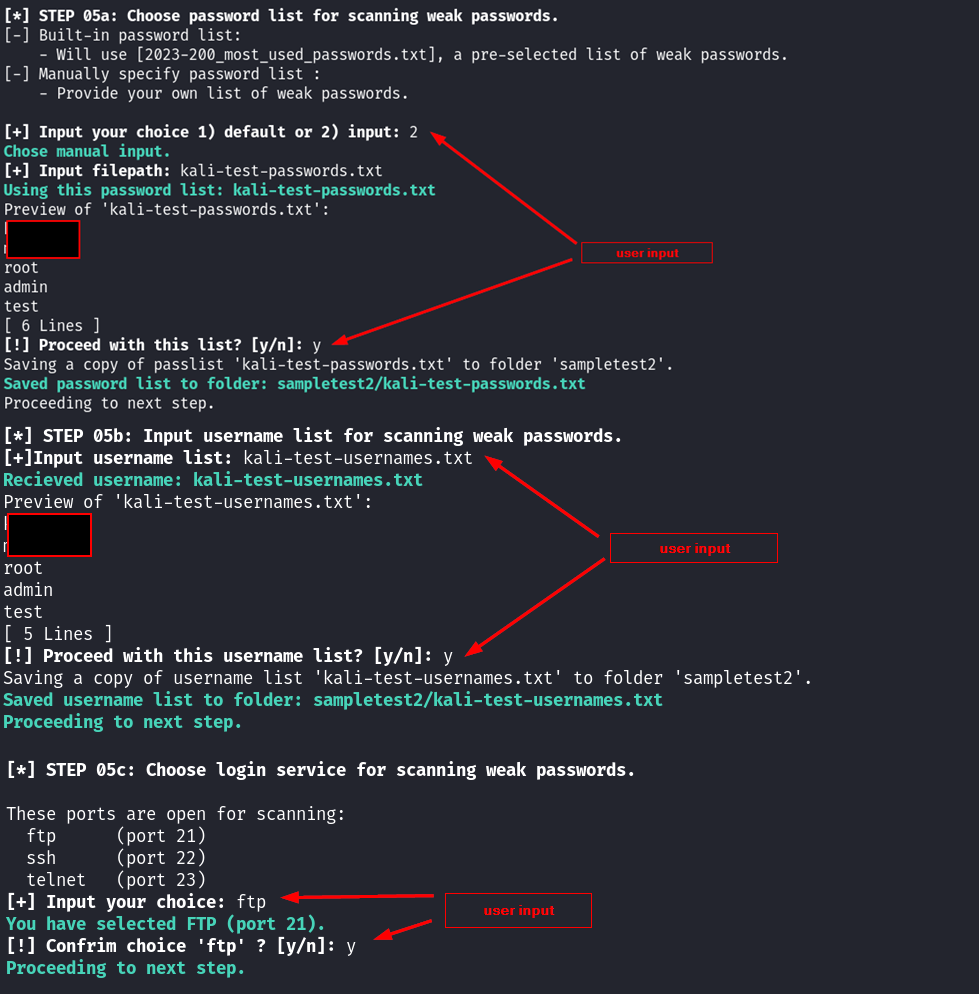
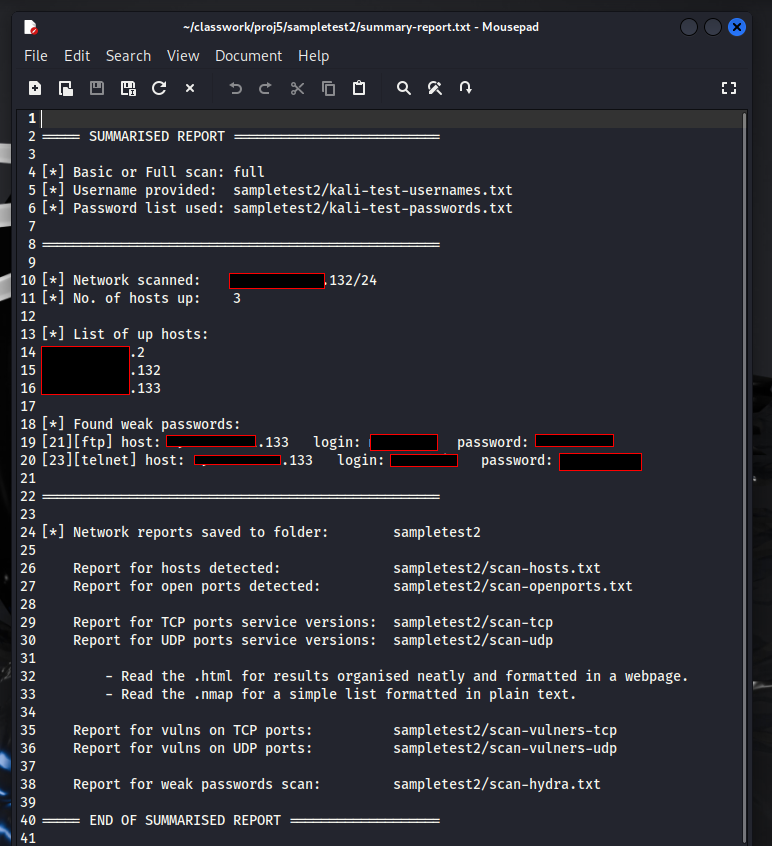

# VulnScan  
A Bash CLI script to automate mapping the network for open ports and their service versions, and CVES related to them. As well as weak login passwords for login services. All results are logged, and a summary report is generated at the end.  
Tested on Kali Linux.  

## How to Use  
In linux terminal, enter `bash vuln-scan.sh`  
  
## Content Structure  
1. Get a network to scan. Choose auto-detect your machine's network, or input.  
2. Get a name to create a new folder. Create the new folder.  
3. Choose basic or full scan.  
4. Scan network  
    a. Nmap host discovery scan. Save the result to a text file.  
    b. Masscan open ports scan. Save the result to a text file.  
    c. Nmap TCP ports service versions. Save the result to files, plain text and html.  
    d. Nmap UDP ports service versions. Save the result to a file, plain text and html.  
    e. (For full scan option) NSE TCP ports vulners scan. Save the result to a file, plain text and html.  
    f. (For full scan option) NSE UDP ports vulners scan. Save the result to a file, plain text and html.  
5. Scan weak passwords  
    a. Get a password list. Choose default or input. Save/copy the file to the created folder.  
    b. Get a username list. Save/copy the file to the created folder.  
    c. Choose login service to scan. Choose FTP, SSH, TELNET, or RDP.  
    d. Hydra scan using saved inputs. Save the result to a file.  
    e. Allow option to scan another login service, or proceed to next step.  
7. Summary  
    a. Save summary to a file.  
    b. Zip the entire folder.  
  
## Output Part 1 - Bash script & input CIDR
Running "bash vuln-scan.sh" in command line. Step 1 asks user if they want to scan what network they are on, or input their own CIDR.  
  
### Choosing 'detect' for step 1
  
  
### Choosing 'input' for step 1  
  
  

## Part 2 - Creating a new folder  
User will be required to input a folder name. A new folder will be created with that name. If folder already exists, an error message will be shown, and user will be asked to input a new name.  
  
  
  
## Part 3 - Choose a basic or full scan  
User can choose basic or full scan, controlling which scripts are run.  
### Choosing 'full' scan for step 3  
  
  
  
## Part 4 - Scanning the network  
Script will use a basic nmap scan for hosts. The list of hosts available is saved to a file.  
Masscan is used to quickly scan all TCP and UDP ports. The list of open ports is saved to a file.  
Nmap -sV is used to find service versions of all the open ports. The results are saved to a file.    
  
  
  
  
### Full scan option checks for CVEs  
The script check and print what type of scan user chose before (in part 3).  
If Full scan is running, NSE Vulners will scan for known CVEs. The results will be saved to a file.  
  
  
  
## Part 5 -  Specify password list, username list, and service to scan, then run Hydra scan
First, user will be asked to choose default password list, or specify their own.  
  
If chosen default, the script will check if the default list is stored in the machine, then make a copy in the created folder from step 2, for easy reference.  
If the file does not exist, it will download the list into the created folder.  
   
If chosen to specify own list, the script will check if the file exist. If does not exist, an error message will be printed and user will be prompted to re-enter another filename. If exists, the file will be copied into the created folder for easy reference.  
  
Second, user will then need to specify a username list. There is no default list for usernames. The same file validation check as previous step will run.  
  
Third, script will check which login services are available for scanning.  
The login services the script will check for are:  
ftp (port 21)  
ssh (port 22)  
telnet (port 23)  
rdp (port 3389)  
Only open ports will be displayed for the user to select from.  
User will input which service to scan against the list of passwords and usernames.  

### Choosing inputs
  
  
Fourth, hydra scan will run using previous 3 inputs. Hydra scan report will be saved to a file. Any found credentials will be printed in terminal as well.  
After scan is complete, the user can opt to run another scan. This is so user can scan multiple open services without repeating the whole process from the beginning.  
  
### Hydra scan
  
  
  
  
## Part 6 - Summary report generated & end of script  
Summary of completed scan is generated and saved to a file.  
User can choose to open created folder to view this summary and all other generated files from the scans.  
A zip of this folder will also be created for easy portability.  
User can choose to open the folder this zip is located in, as this is the expected to be the user's next action after completing this script.  
  
  
  
### Example of content in generated summary report  
A quick glance at information collected from all the scans.  
1. Type of scan chosen
2. Username list filename
3. Password list filename
4. Network scanned
5. Number of hosts found
6. List of their IP addresses
7. Credentials found based on provided username & password list
8. List of reports generated and where to find them
  
  
  
## Sample files  
Sample files output into newly created folder  
  
  
  
