# VulnScan  
A Bash CLI script to automate mapping the network for open ports and their service versions, and CVES related to them. As well as weak login passwords for login services.  
All results are logged, and a summary report is generated at the end.  
Tested on Kali Linux.  

## How to Use  
In linux terminal, enter `bash vuln-scan.sh`  
  
## Content Structure  
1. Get a network to scan. Choose auto-detect your machine's network, or input.  
2. Get a name to create a new folder. Create the new folder.  
3. Choose basic or full scan.  
4. Scan network  
    a. Nmap host discovery scan. Save the result to a text file.  
    b. Masscan open ports scan. Save the result to a text file.  
    c. Nmap TCP ports service versions. Save the result to files, plain text and html.  
    d. Nmap UDP ports service versions. Save the result to a file, plain text and html.  
    e. (For full scan option) NSE TCP ports vulners scan. Save the result to a file, plain text and html.  
    f. (For full scan option) NSE UDP ports vulners scan. Save the result to a file, plain text and html.  
5. Scan weak passwords  
    a. Get a password list. Choose default or input. Save/copy the file to the created folder.  
    b. Get a username list. Save/copy the file to the created folder.  
    c. Choose login service to scan. Choose FTP, SSH, TELNET, or RDP.  
    d. Hydra scan using saved inputs. Save the result to a file.  
    e. Allow option to scan another login service, or proceed to next step.  
7. Summary  
    a. Save summary to a file.  
    b. Zip the entire folder.  
  
## Output  
Choosing detect for step 1  
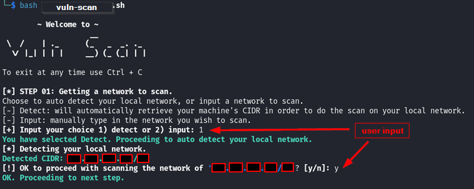  
Choosing input for step 1  
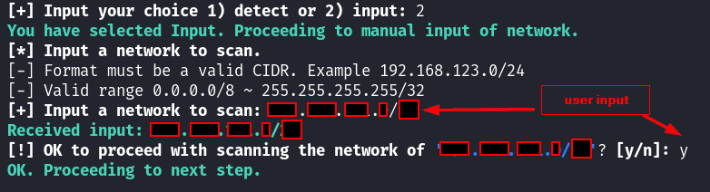  
Step 2  
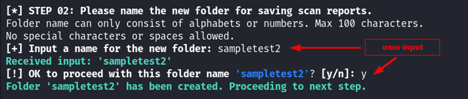  
Choosing full scan for step 3  
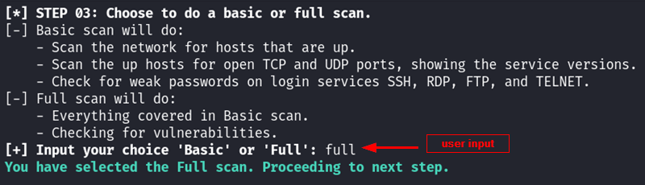  
Step 4abcd  
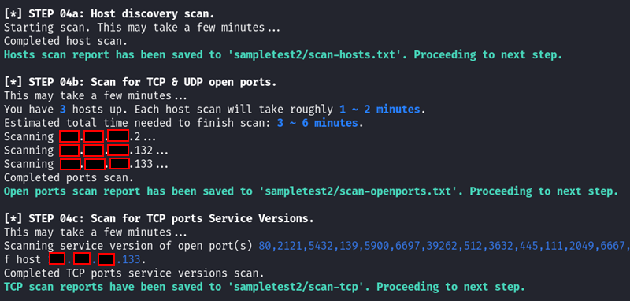  
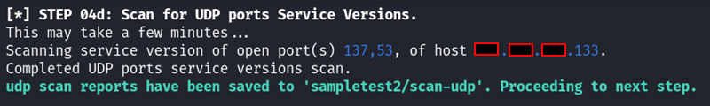  
Step 4ef (only for full scan)  
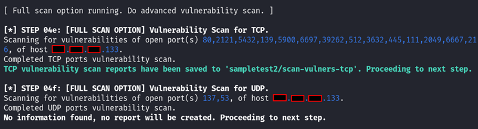  
Choosing input for step 5a  
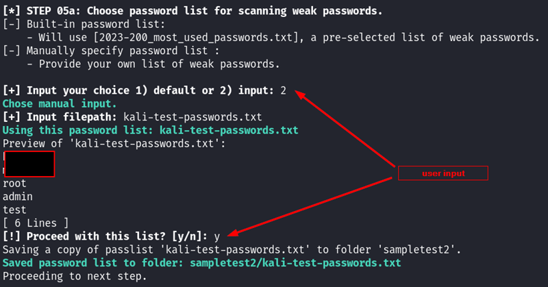  
Step 5b  
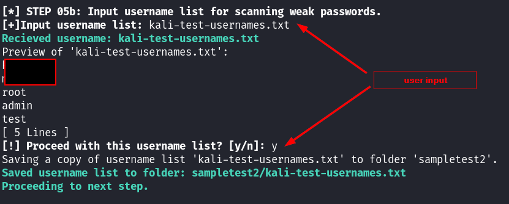  
Step 5c  
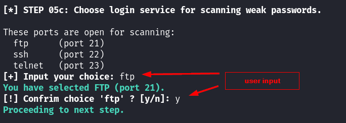  
Step 5d
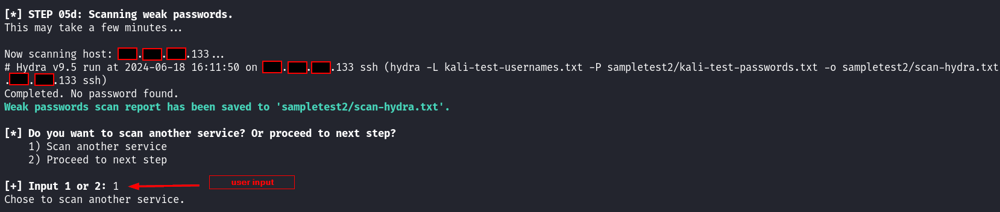  
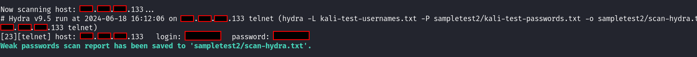  
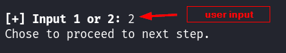  
Step 6  
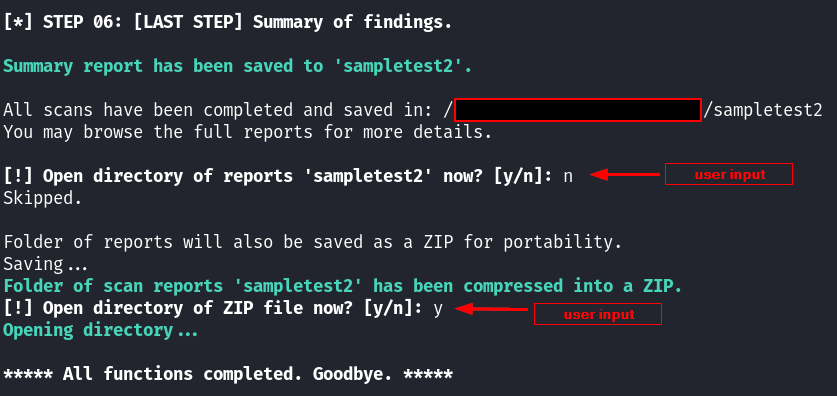  
Sample files output into newly created folder    
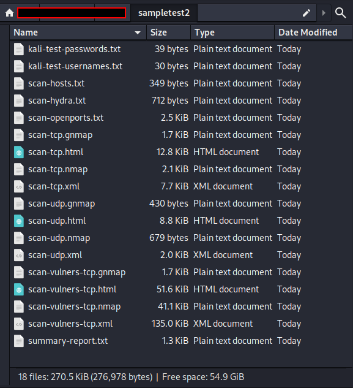  
  
